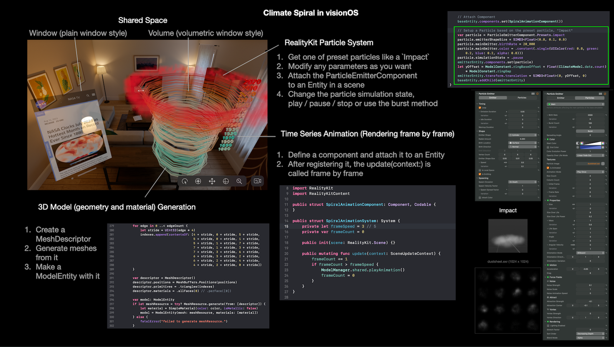

# Climate Spiral in visionOS

Very simple AR app in visionOS, that shows the climate spiral, which is known as a way to visualize global surface temperature change.

- Build: Xcode 15.2 beta, macOS 14.2
- Target: visionOS 1.0 beta (You can run this app with the Vision Pro simulator of Xcode 15.)

*Since this project is based on the beta software, this repository is temporal and will be deleted after a while.*

This project shows some features of RealityKit in visionOS;

- Geometry and material generation at run-time : makes the spiral 3d model from the temperature data.
- Time series animation with Entity Component System : plays annual and monthly temperature changes.
- Particle system : adds a visual effect and preset particles make it easy to use.

## Data Sources

- NASA GISS Surface Temperature Analysis (GISTEMP v4) [Global-mean monthly, 1880-present](https://data.giss.nasa.gov/gistemp/)

## References

- RealityKit Particle System overview [GitHub](https://github.com/ynagatomo/evolution-Metal-ARKit-RealityKit-sheet)
- NASA Release Aug 14, 2023 [NASA Clocks July 2023 as Hottest Month on Record Ever Since 1880](https://www.nasa.gov/press-release/nasa-clocks-july-2023-as-hottest-month-on-record-ever-since-1880)

## License

